# gluon

A REPL and scratch runner for Go, for when you want to check what `s[i]` prints
without writing a `main` package first.

<!-- gluon:shot hero -->

<!-- gluon:end -->

Go doesn't come with a REPL. So when you want to know what one line does, you
write a `main` package, run it, read the answer, and delete it. Every time.
That's a lot of ceremony for one question.

There are REPLs for Go, but each one makes you give something up. The
interpreters are quick, but their answers are the interpreter's, not the
compiler's. The one that does use the real compiler builds the whole program
for every line, even when all you wanted was a type error.

I wanted both: the compiler's answers, and no build for the questions that
don't need one. Nothing did that, so I built it.

## Here's how it works

Every picture here is a screenshot of the release build in a real terminal.
Cropped, and nothing else.

### Type a line, see what it does

<!-- gluon:shot values -->
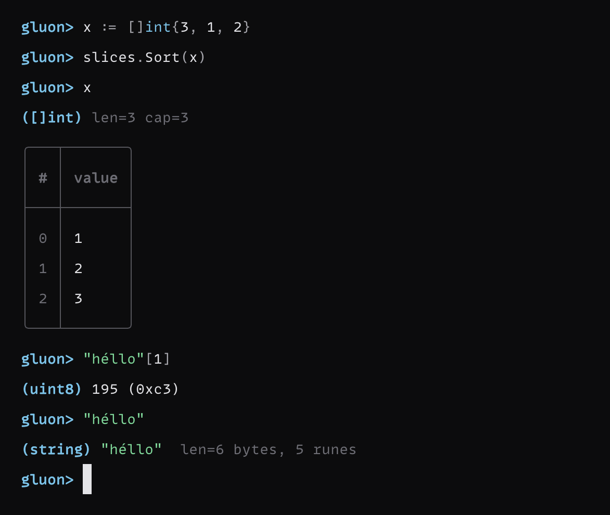
<!-- gluon:end -->

That's the whole idea. Type Go, press enter, and the answer comes back.

You'll notice nothing imports `slices`. gluon writes the imports for you. And
when the first line declares `x` without using it yet, Go would refuse to
compile. gluon doesn't mind. Scratch code shouldn't have to be tidy.

Every value comes back with its type and the facts you'd otherwise print a
second time. `"héllo"[1]` isn't `é`, it's a byte: 195. And `"héllo"` is 6 bytes
but 5 runes. Go teaches everyone that eventually. Here it takes one line. More
in [The first five minutes](https://sandboxws.github.io/gluon/guide/start.html).

### The real compiler, and no build when you don't need one

<!-- gluon:shot fast-errors -->
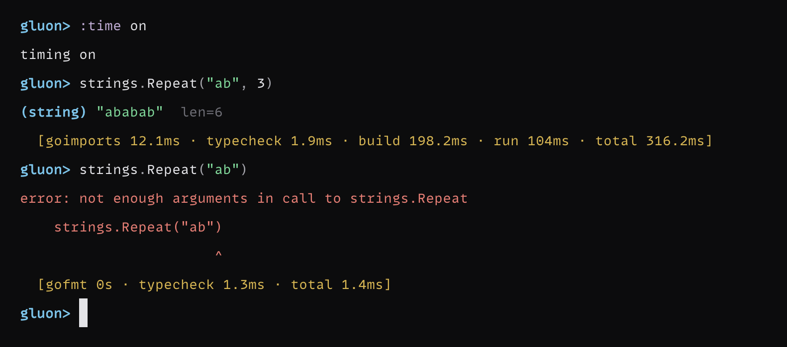
<!-- gluon:end -->

Every line becomes part of a real Go program, compiled by your own Go
toolchain and run. So what you see is what the compiler does. There's no
interpreter in here to disagree with it.

A line that runs costs about 300 milliseconds: a real build, then a real run.
But plenty of lines don't need to run. gluon checks types in its own process
first, so a type error, a declaration, a constant or a question about a type
comes back in about a millisecond. `:time on` shows where each line's time
went. More in [How it works](https://sandboxws.github.io/gluon/guide/design.html#latency).

### What is this, and what can it do?

<!-- gluon:shot types -->
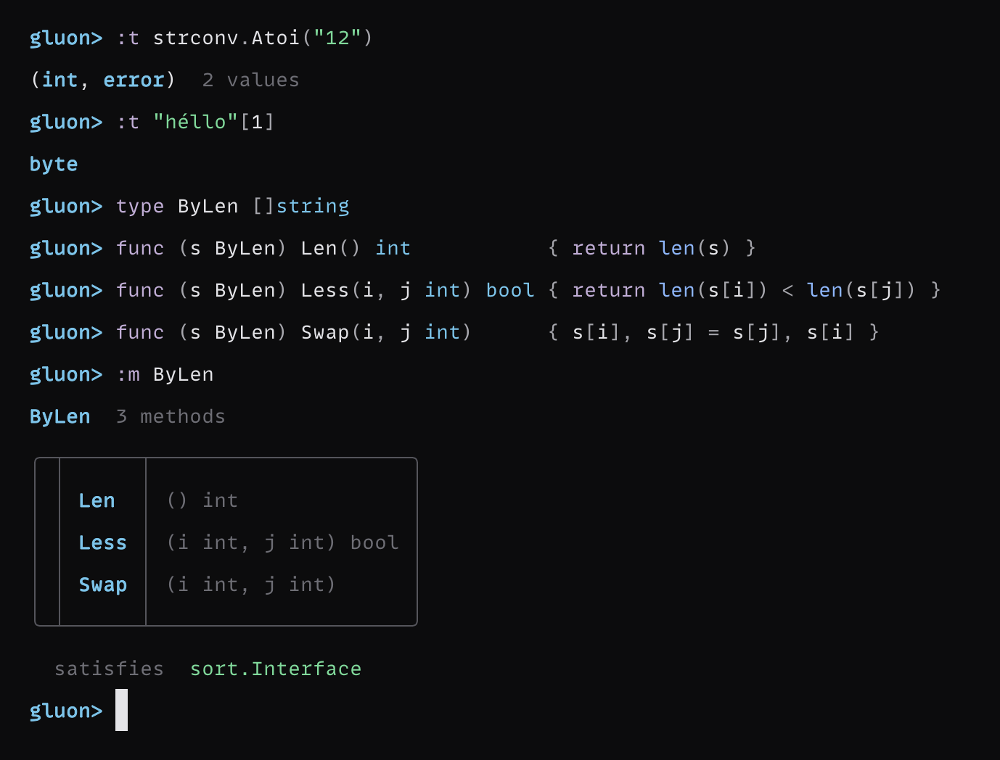
<!-- gluon:end -->

What does `strconv.Atoi` return? An `int` and an `error`. What's a string
index? A `byte`. Does `ByLen` satisfy `sort.Interface`? It does, and `:m` lists
the methods that make it so.

`:t` and `:m` ask the type checker, not your memory. No build, a millisecond
each. More in [Inspecting](https://sandboxws.github.io/gluon/guide/inspecting.html).

### How big is this struct, really?

<!-- gluon:shot layout -->
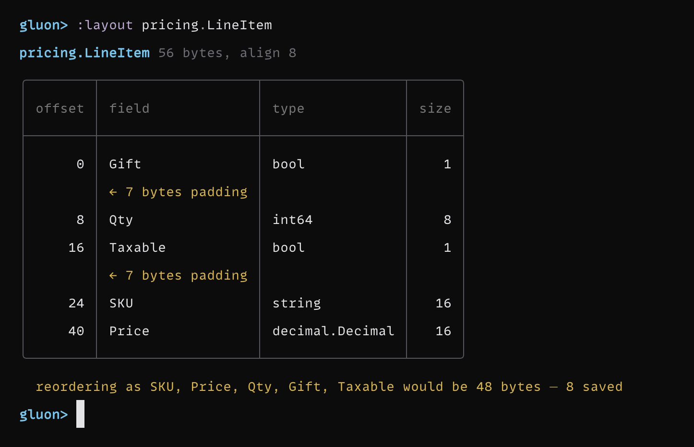
<!-- gluon:end -->

`:layout` shows every field's offset and size, and the padding in between.
`pricing.LineItem` loses 7 bytes to padding, twice, just because of the order
its fields are in. gluon tells you the order that fixes it, and what that
saves.

### Do these two slices share memory?

<!-- gluon:shot slice -->
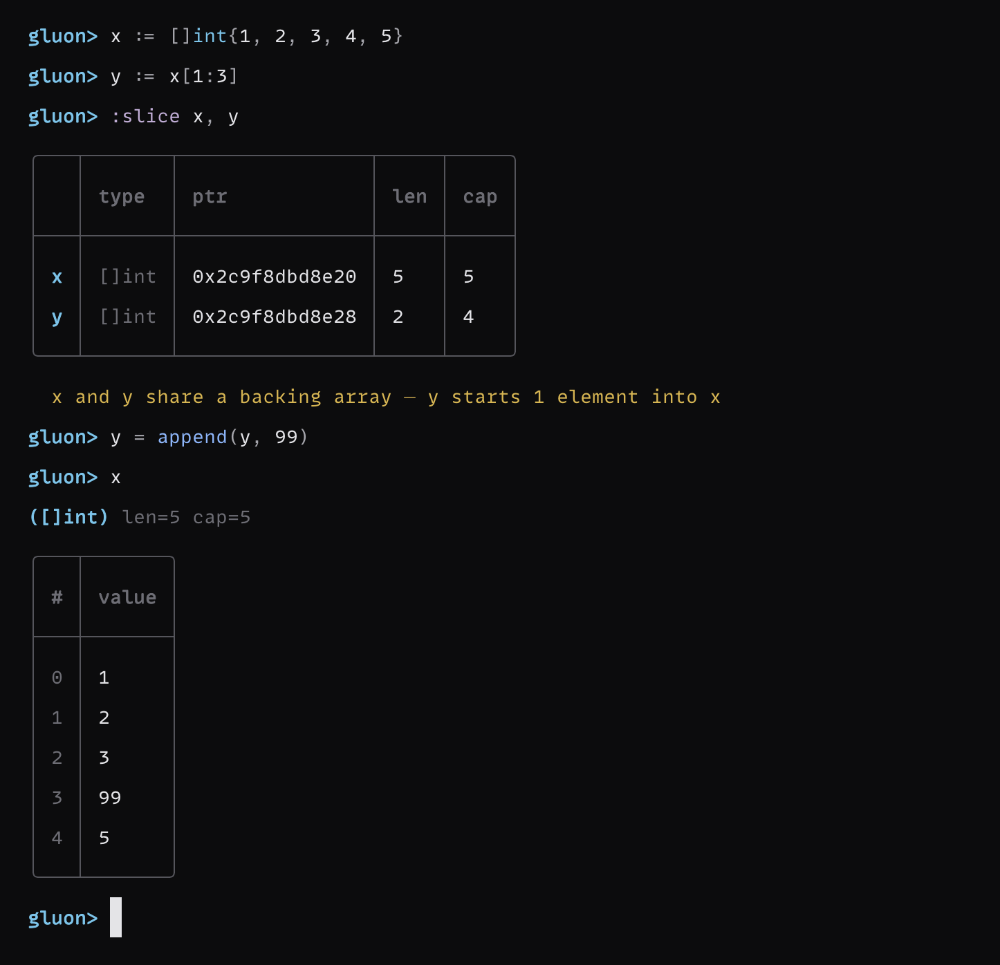
<!-- gluon:end -->

`:slice` shows when two slices share a backing array, and where one starts
inside the other. So when an `append` through `y` quietly overwrites `x[3]`,
you can see it coming.

### Which one is faster?

<!-- gluon:shot bench -->
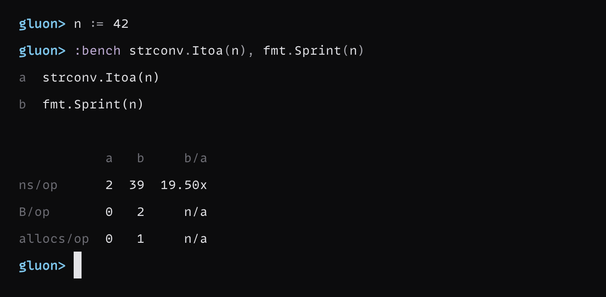
<!-- gluon:end -->

`:bench` runs a real `testing.B` benchmark right from the prompt. Two
expressions, side by side, with the ratio. No `_test.go` file, no package to
set up. More in [Measuring](https://sandboxws.github.io/gluon/guide/measuring.html).

### Does it escape? Is it inlined?

<!-- gluon:shot compiler -->
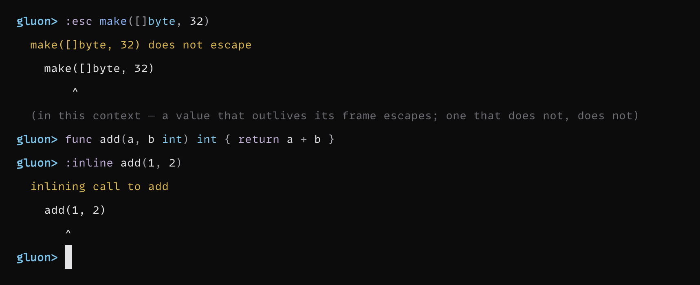
<!-- gluon:end -->

`:esc` and `:inline` ask the compiler itself, and point at the expression they
mean. No guessing from rules of thumb.

### What did Go 1.27 add?

<!-- gluon:shot since-127 -->
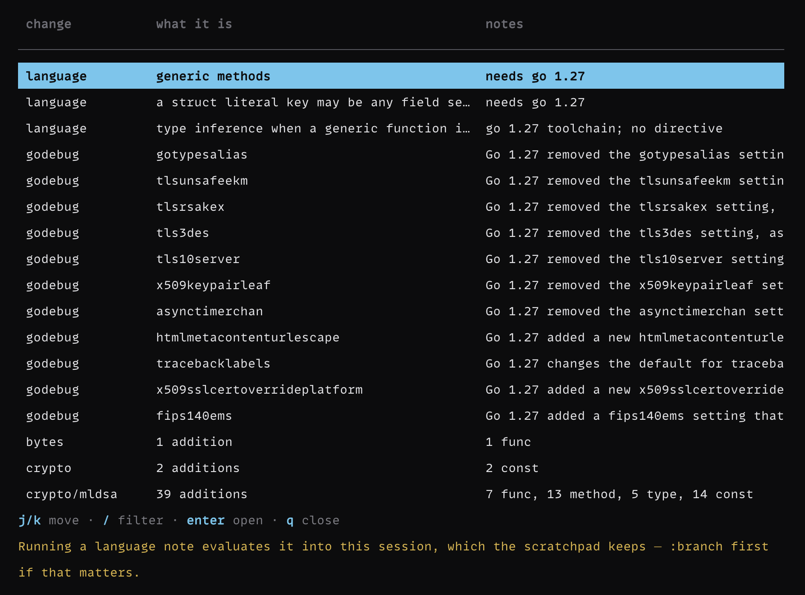
<!-- gluon:end -->

`:since` knows what every Go release added, from the language changes to each
new standard library symbol. It reads them from the toolchain on your machine,
so it works offline.

### What does this function actually do?

<!-- gluon:shot doc-src -->
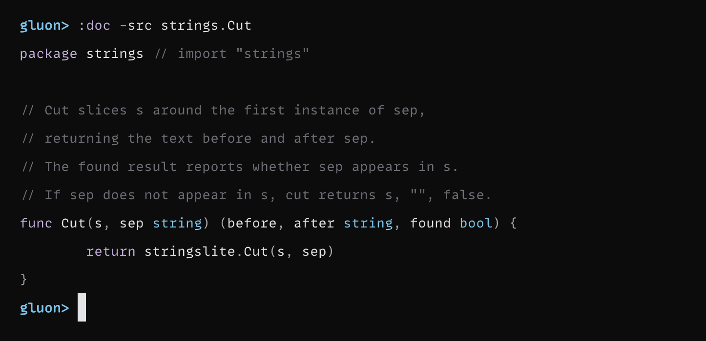
<!-- gluon:end -->

`:doc` prints the documentation for anything you can import, and `-src` prints
the source. Offline too, read from the code your build actually uses.

### Your project, and its database

<!-- gluon:shot db -->
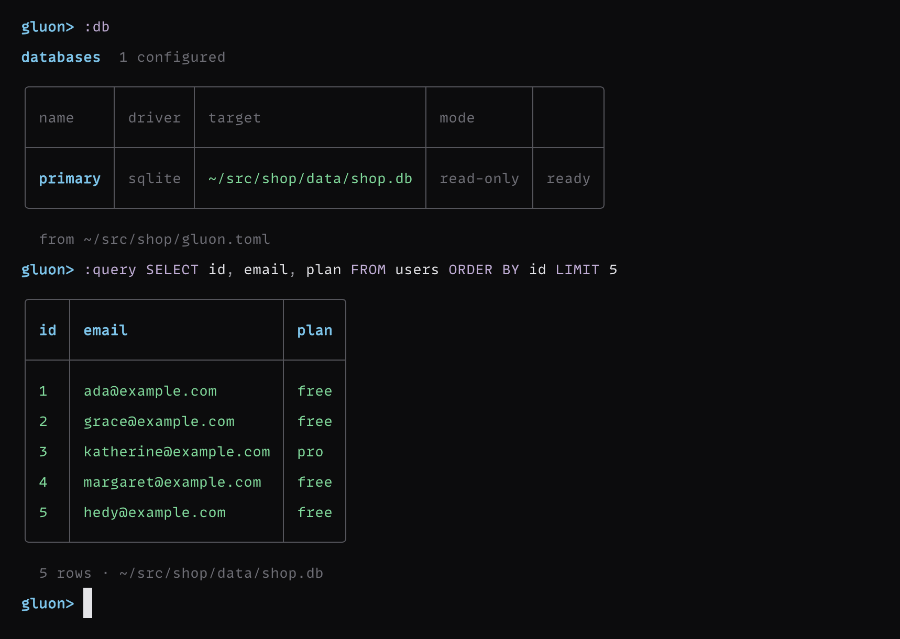
<!-- gluon:end -->

Start gluon with `-host .` in a Go project, or type `:use .`, and the project's
packages import. The ones under `internal/` too, which is usually the
interesting half. That's the screenshot at the top: the project's own code, at
the prompt.

gluon also finds the database the project is configured to reach. Write it
down once with `gluon init` and `:query` runs SQL through your project's own
driver, read-only unless you say `-w`. It never stores a password, only where
the connection string lives. More in
[In a project](https://sandboxws.github.io/gluon/guide/project.html) and
[The database](https://sandboxws.github.io/gluon/guide/database.html).

### What does my API send back?

<!-- gluon:shot http -->
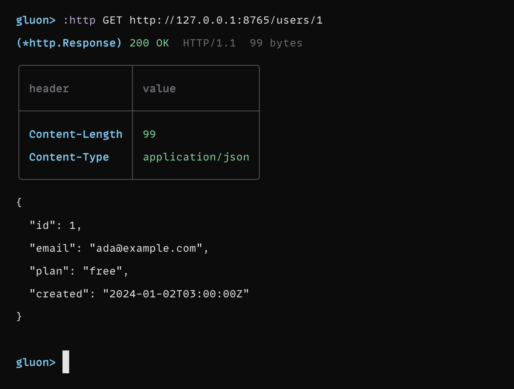
<!-- gluon:end -->

`:http` makes a request and shows the response the way Go sees it: status,
headers, body. Handy when the server you're poking at is the one you're
writing.

### Plugins for the libraries you already use

<!-- gluon:shot plugins -->
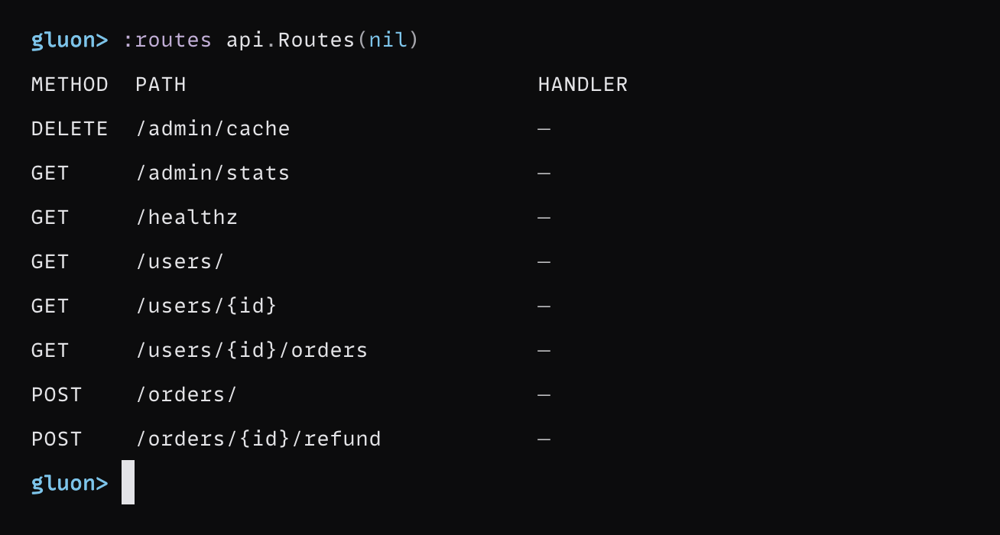
<!-- gluon:end -->

Plugins switch themselves on from your `go.mod`. With chi in the build list,
`:routes` lists every route your router declares. There are plugins for gin,
echo and the other routers, gorm, sqlx, ent, pgx, protobuf, gRPC, cobra, viper
and more. Each one stays out of the way until your project uses its library.

<!-- gluon:shot grpc -->
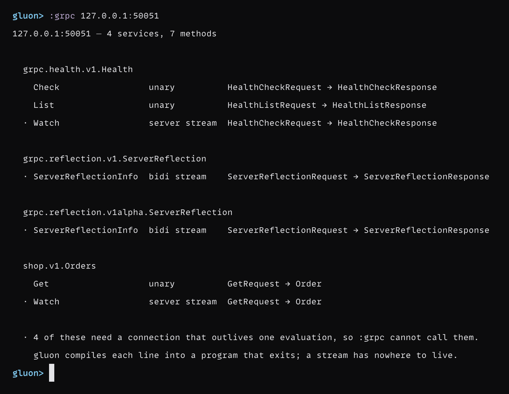
<!-- gluon:end -->

The gRPC one finds a running server's services through reflection, and calls a
unary method with a JSON body. No stubs, no client to write. More in
[Plugins](https://sandboxws.github.io/gluon/guide/plugins.html).

### Quit. Come back. It's all still there.

<!-- gluon:shot scratch -->
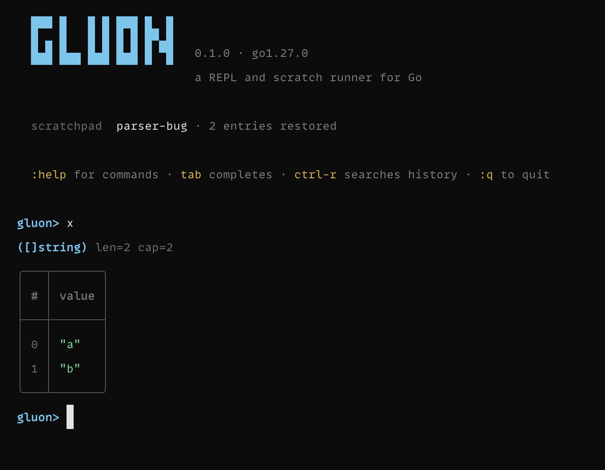
<!-- gluon:end -->

Every session lands in a scratchpad. Quit, come back tomorrow, and it replays,
so your variables are still there. Keep a few going under different names.
When one grows up, `:save` turns it into a module you can open in your editor.
More in [Scratchpads](https://sandboxws.github.io/gluon/guide/scratchpads.html).

### Every command explains itself

<!-- gluon:shot help -->
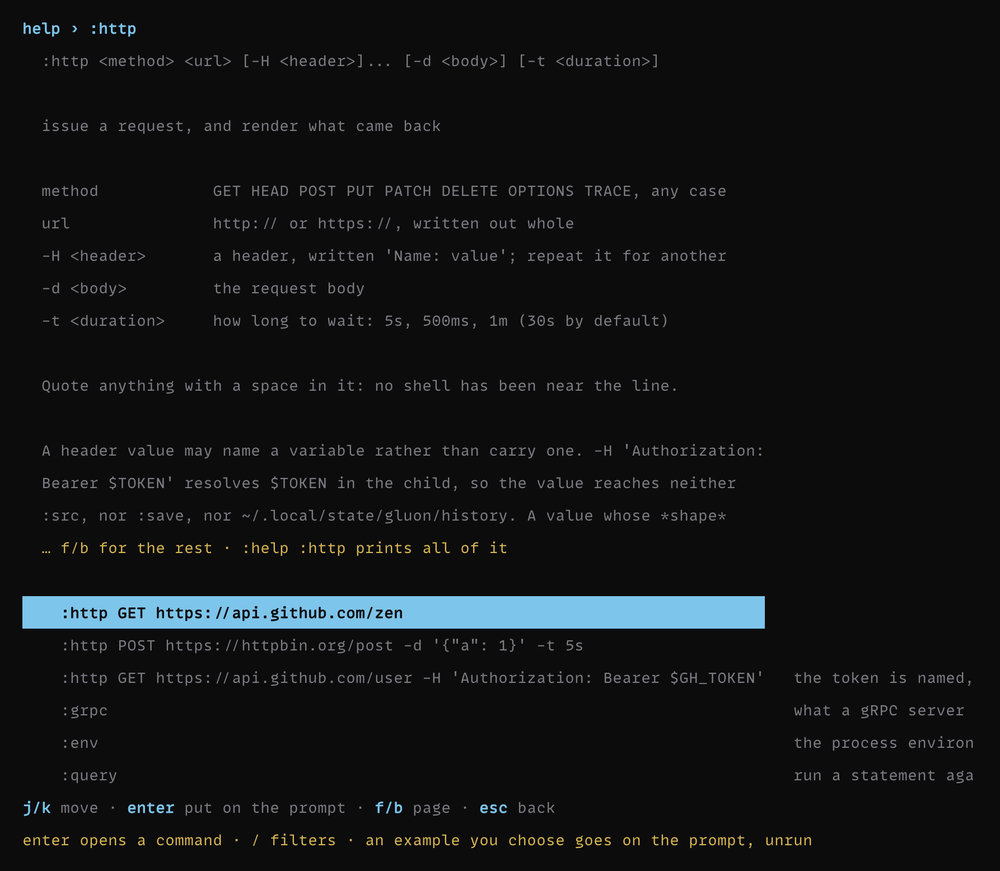
<!-- gluon:end -->

`:help :http` opens the command's page: what it takes, its flags, and examples
you can put straight on the prompt. You don't even need that much. Start typing
a command and its usage shows up beside the line:

<!-- gluon:shot help-hint -->

<!-- gluon:end -->

Press tab for its flags. Nothing to memorise.

### Your colours

<!-- gluon:shot theme -->
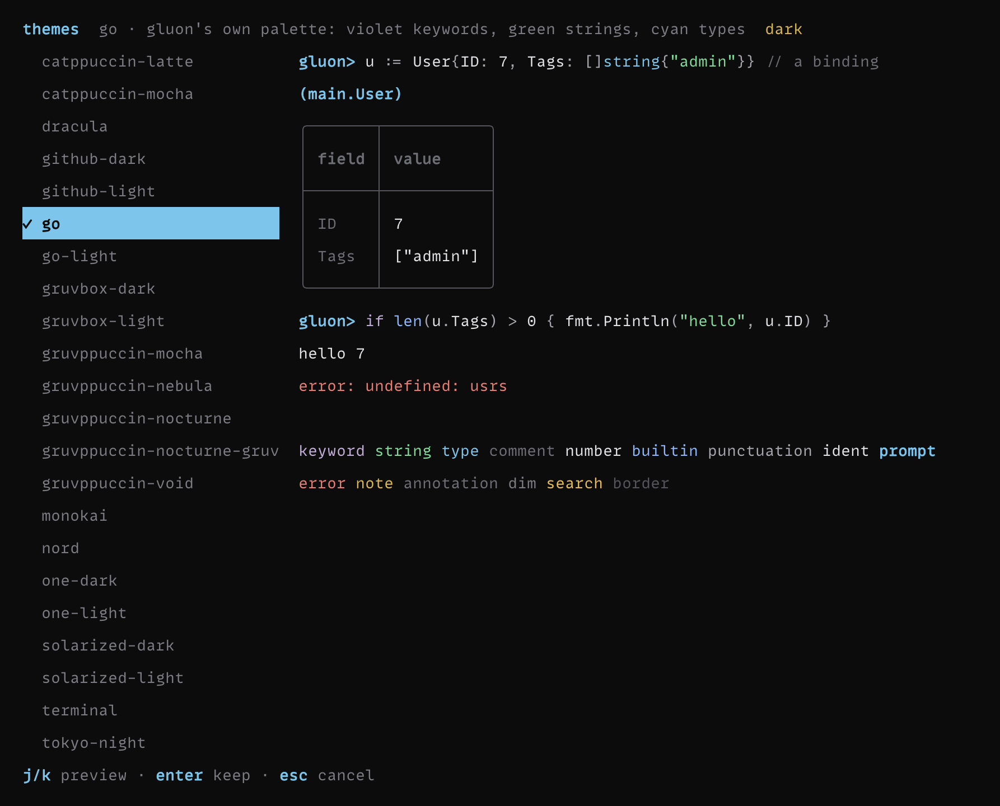
<!-- gluon:end -->

`:theme` previews every theme on real code as you move through the list. Or
bring your own: `gluon theme import` converts a TextMate, VS Code or IntelliJ
theme. More in [Themes](https://sandboxws.github.io/gluon/guide/themes.html).

### From your shell, and for your agent

Every inspector works as a one-liner too, with a `-json` form for scripts.

<!-- gluon:session readme-oneshot -->
```
$ gluon -e 'strings.ToUpper("hi")'
(string) "HI"  len=2
$ echo 'len("héllo")' | gluon
(int) 6
```
<!-- gluon:end -->

And `gluon mcp` hands the same inspectors to a coding agent, so it checks a
method set or a struct's layout instead of guessing. In Claude Code that's one
line:

```
claude mcp add gluon -- gluon mcp
```

Out of the box the agent only gets the tools that run nothing. Running code
takes `--eval`, and that's your call, not the agent's: it's a flag in the
config you write. More in
[Scripting](https://sandboxws.github.io/gluon/guide/scripting.html) and
[MCP](https://sandboxws.github.io/gluon/guide/mcp.html).

### And more

That's the short tour. There's also `:profile` and `:memprof` for where the
time and the allocations went, `:race` for the race detector, `:mock` and
`:spy` when you need a fake for an interface, `:diff` for two values, and
`:test` to turn what you just checked into a Go test. Completion comes from the
type checker, vim keys are there if you want them, and a big value opens in a
view you can scroll and filter.

[The guides](https://sandboxws.github.io/gluon/guide/) walk through all of it,
every command in a session that really ran.

## Here's the catch

Every line replays the whole session. That's the price of building a real
program each time, and it means side effects repeat. A line that sends an HTTP
request sends it again with every line you type after it. A file gets written
again. gluon mutes the output of the replayed lines, so you only see the
newest one's, but the re-run is real.

`:pin` is the way out. It takes a line out of the replay, which is you telling
gluon it already happened.
[The session guide](https://sandboxws.github.io/gluon/guide/session.html#replay)
walks through it.

## Install

```
go install github.com/sandboxws/gluon/cmd/gluon@latest
```

Or `brew install sandboxws/tap/gluon`, or a binary from
[Releases](https://github.com/sandboxws/gluon/releases). It runs on macOS and
Linux, amd64 and arm64. On Windows, use WSL.

All it needs is Go on your `PATH`. The toolchain is the evaluator, so there's
nothing else to install. `gluon doctor` checks your setup and measures what
your machine adds to every line.

What does it cost? Nothing. gluon is free and MIT licensed.

That's gluon. I hope it saves you a few `main` packages. If something's wrong
or missing, [open an issue](https://github.com/sandboxws/gluon/issues).

## How it compares

**gore** is the closest relative. It's also a REPL on the real toolchain,
mature and MIT licensed, with completion from gopls. The differences are why
gluon exists:

- gore does a full `go run` for every line, even one that only needed a type
  error. gluon answers those in about a millisecond, without a build.
- gore prints replayed output again on every line. gluon mutes it at the
  file-descriptor level, which keeps a program that prints something different
  each run readable.
- gluon brings over the parts of pry that Go never had: `it`, `:doc -src`, and
  a printer that labels a shared value instead of printing it twice. It also
  reaches your project's `internal/` packages, its database and its libraries.

Lines that actually run cost about 300ms in both. That's the price of the real
compiler, and neither tool gets around it.

**yaegi** and **gomacro** are interpreters. They're fast, but the semantics are
the interpreter's. yaegi's standard library tables target Go 1.21 and 1.22, and
gomacro doesn't import generic standard library functions at all. So
`slices.Sort` and `maps.Keys`, most of modern Go really, break under both. If
you're using a REPL to learn Go, an interpreter that quietly disagrees with
the compiler teaches you the wrong Go.

**gophernotes** is a Jupyter kernel built on gomacro. Same trade-off, different
surface. gluon is a terminal tool, not a kernel.

None of them talks to a coding agent. gluon does, through `gluon mcp`.

## Every command

`:help` lists them all. `:help <command>`, or `<command> --help`, opens one
command's page: what it takes, its flags, lines to try, and where to go next.

<details>
<summary>The full list</summary>

<!-- gluon:help:start -->
<!-- generated by `just docs` from the command registry: edit the registry, not this -->
```
  the session
  :help [command]      this, or detail on one command
  :q                   quit
  :clear               clear the screen (ctrl-l), keeping the session
  :reset [-deps]       clear the session, and with -deps its modules too
  :theme [name]        the colour themes, and switch between them
  :settings [key=val]  every setting gluon has, and change one
  :plugins             which library plugins are active here, and why
  :guide <plugin>      a plugin's cheatsheet

  inspecting
  :t [-v|-d] <exp>     the type of an expression      (Ruby's .class)
  :m <exp>             its method set and interfaces  (Ruby's .methods)
  :impl <t>, <i>       does a type implement an interface, and what is missing
  :sat <exp>, <i>      the same question, asked of a value
  :cast <e>, <t>       whether e.(t) is legal, and why not
  :iface <name>        an interface's methods, and who implements it
  :embeds <type>       embedded fields, and the methods they promote
  :gen <type>          a generic's type parameters and their constraints
  :mock <type>         a mock implementation of an interface
  :spy <type>          the same, recording what each method was called with
  :ls                  what is in scope, with types   (pry's ls)
  :doc [flags] <s>     documentation, or the source   (ri / pry's show-source)
  :since [version]     what each Go release added, from the toolchain you have
  :slice a, b          slice headers, and whether they share a backing array
  :diff a, b           what differs between two values, and where
  :layout <type>       field offsets, padding, and what reordering would save
  :err <exp>           the wrapped error chain, with the type at each level
  :bench [flags] a[,b] ns/op, B/op and allocs/op, through testing.B
  :profile <exp>       where the time went, from a real run
  :memprof <exp>       where the allocations went, from a real run
  :trace <exp>         the call stack the expression is evaluated on
  :esc <exp>           whether the value reaches the heap
  :inline <exp|func>   what the compiler decided about inlining
  :asm <func>          the assembly emitted for one declared function
  :vet [exp]           what go vet says about the session
  :race <exp>          run it once under the race detector
  :env [pattern]       the process environment, redacted   (Rails.env's neighbour)
  :conf [file]         read a project config file, redacted
  :inspect [-n k] <e>  browse a large value in a view that scrolls
  :http <m> <url>      issue a request, and render what came back

  the module it can see
  :use [dir|-off]      attach to the Go module at dir, so its packages import
  :get [-rm] [module]  add or remove a module, or list them  (the only one that fetches)
  :reload              re-read the attached module after editing it  (Rails' reload!)
  :watch [on|off]      reload by itself when the host's source changes
  :db [name]           the databases this project is configured to reach
  :query [flags] <sql> run a statement against the project's database

  the transcript
  :src                 show the real Go program your session became
  :undo                drop the last entry
  :test [-table] <exp> the session's own judgement, written down as a Go test
  :save [flags|topic]  write the session out as a runnable scratch module
  :scratch [flag|name] the scratchpad this session is saved in, and the way between them
  :hist                number the session's entries
  :drop <n>            remove one of them
  :pin [n]             stop an entry re-running on replay
  :unpin <n>           put a pinned entry back into the program
  :refresh             run the pinned entries once more
  :load <file>         read a file in, line by line
  :bookmark [name]     snapshot the session under a name, or list the snapshots
  :branch [name]       snapshot and keep going, naming it for you if you like
  :restore <name>      put a snapshot back, and replay it
  :replay <pattern>    find lines in the persisted history and bring them in
  :share               show the program, then publish it to the Go Playground
  :edit                open the session in $EDITOR and reload it  (pry's edit)
  :buf [flag]          a buffer you edit and run as one evaluation
  :time [on|off]       show where each line's latency went

  from plugins
  :json <exp>          the value as indented JSON, the way it goes over a wire
  :xml <exp>           the value as indented XML, with the tags applied
  :csv <exp>           a sequence of records as CSV, header included
  :when <exp>          a time.Time in the forms you actually want to read
  :slog <exp>          how the value appears in a structured log line
  :dec <exp>           a decimal's exact value, and what float64 would have done to it
  :sql <chain>         the SQL a gorm chain produces, and its arguments
  :expand <query>      the query after sqlx rewrites it, and the arguments in their new order
  :schema <tables>     the tables, columns and edges ent generated, without a connection
  :migrations [name]   which migrations have been applied, from the tracking table
  :routes <router>     every route registered on the router
  :tree <command>      a cobra command and everything under it
  :services <i>        what a container has registered, and where each provider came from
  :graph <i>           how a container's providers depend on one another
  :config <v>          the settings this config library resolved
  :yaml <exp>          the value as YAML, with its yaml tags applied
  :toml <exp>          the value as a TOML document, with its toml tags applied
  :msgpack <exp>       the msgpack bytes a value encodes to, as a hex dump
  :pb <exp>            the wire size of a proto message, and its text form
  :grpc <addr> [m]     what a gRPC server exposes, and one unary call against it
```
<!-- gluon:help:end -->

</details>

## Documentation

[The docs](https://sandboxws.github.io/gluon/) have a guide for each part of
gluon, and every command in them is worked through in a session that really
ran.

<!-- gluon:guides -->
- **[The first five minutes](https://sandboxws.github.io/gluon/guide/start.html)** — Install gluon, type Go, and read what comes back: a value with the truth attached, it and _N, errors that name your line, and help for every command.
- **[Inspecting](https://sandboxws.github.io/gluon/guide/inspecting.html)** — What is this, and what can it do: types, method sets, interfaces, memory layout, documentation and what each Go release added — most of it answered by the type checker, without a build.
- **[Measuring](https://sandboxws.github.io/gluon/guide/measuring.html)** — How fast it is, where the time and the allocations went, and what the compiler decided about it — through testing.B, pprof, the compiler's own reports, vet and the race detector.
- **[Rendering](https://sandboxws.github.io/gluon/guide/rendering.html)** — How a value is drawn: five shapes, cycles and sharing said out loud, how much of a value you see, and a view that scrolls for the large ones.
- **[The session](https://sandboxws.github.io/gluon/guide/session.html)** — The program your lines became, why every line replays and what that costs, and the commands that edit, snapshot, recall and test a session.
- **[Scratchpads](https://sandboxws.github.io/gluon/guide/scratchpads.html)** — A session kept on disk under a name, graduated into a module you can open in an editor or a debugger, or shared as a playground link.
- **[Editing](https://sandboxws.github.io/gluon/guide/editing.html)** — Completion from the type checker, readline and vim keys, the session in your editor, a buffer for more than a line, and gluon's own editor.
- **[In a project](https://sandboxws.github.io/gluon/guide/project.html)** — Attach to the module you are standing in: its internal packages, a reload after you edit it, modules you add, its environment and config, and requests to it.
- **[The database](https://sandboxws.github.io/gluon/guide/database.html)** — What gluon found and where, written down as a reference and never a password, then queried through the project's own driver.
- **[Plugins](https://sandboxws.github.io/gluon/guide/plugins.html)** — What each library plugin adds — renderers, and a command for the question worth asking — worked through against a real service, and how to write your own.
- **[Configuration](https://sandboxws.github.io/gluon/guide/configuration.html)** — Every setting from the prompt, config.toml, the startup screen, and the environment variables gluon reads.
- **[Themes](https://sandboxws.github.io/gluon/guide/themes.html)** — Twenty-three palettes chosen while looking at your own code, the ground each was drawn for, your own, and one converted from an editor theme.
- **[Scripting](https://sandboxws.github.io/gluon/guide/scripting.html)** — gluon -e, pipes and -json: every inspector as a shell one-liner, against a project or not, and a struct held to its layout in CI.
- **[MCP](https://sandboxws.github.io/gluon/guide/mcp.html)** — gluon mcp: the inspectors as tools a coding agent calls, in two tiers, with execution granted by whoever edits the config.
- **[How it works](https://sandboxws.github.io/gluon/guide/design.html)** — Why the real compiler, where a line's time goes, what replaying the session costs, how gluon compares, and what it never does.
<!-- gluon:end -->

The [reference](https://sandboxws.github.io/gluon/reference/) covers every
command, plugin, setting, subcommand, MCP tool and theme. It's generated from
the code that defines each one, so it can't fall out of date.
[ROADMAP.md](ROADMAP.md) is the design record: what each version taught, what
was turned down and why, and the rules the code is held to.

## Development

```
just check              # fmt, vet, tests
just test-integration   # the tests that really invoke the toolchain
just install            # → ~/go/bin/gluon
just docs               # render docs/ from site/ and the registries
just docs-sessions      # record the guides' transcripts again
just shots              # take the screenshots again, in one new Ghostty window
just promo              # turn the last shots into the docs' images
```

`docs/` is generated, so edit `site/` instead. `just test` fails whenever
`docs/` says something the code no longer does. The screenshots come from
`tapes/`, and [tapes/README.md](tapes/README.md) explains how they're taken.
[CONTRIBUTING.md](CONTRIBUTING.md) has the rest.

## License

MIT. See [LICENSE](LICENSE).
