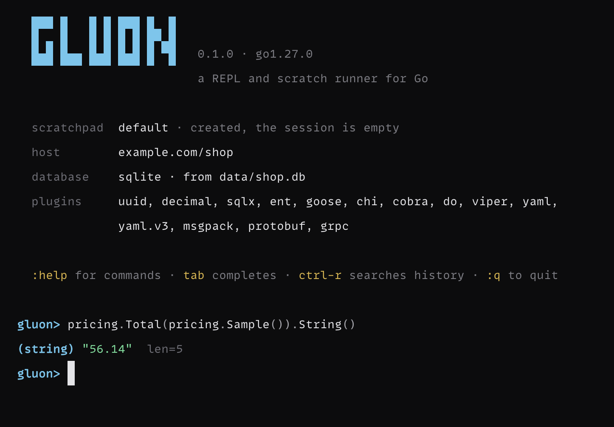

# gluon

A REPL and scratch runner for Go, for when you want to check what `s[i]` prints
without writing a `main` package first.

<!-- gluon:shot hero -->

<!-- gluon:end -->

<!-- gluon:session start-first -->
```
gluon> x := []int{3, 1, 2}
gluon> slices.Sort(x)
gluon> x
([]int) len=3 cap=3
╭───┬───────╮
│ # │ value │
├───┼───────┤
│ 0 │ 1     │
│ 1 │ 2     │
│ 2 │ 3     │
╰───┴───────╯
gluon> "héllo"[1]
(uint8) 195 (0xc3)
gluon> "héllo"
(string) "héllo"  len=6 bytes, 5 runes
```
<!-- gluon:end -->

Every line re-renders the whole session into a genuine Go program and compiles
it with your real toolchain, so the semantics are the compiler's — while an
in-process type checker answers errors, `:t`, `:m` and constants in about a
millisecond, without building anything.

**[The documentation](https://sandboxws.github.io/gluon/)** is a guide for
each part of gluon, every command worked through in a session that really ran,
and a reference generated from the code.

## Install

macOS and Linux, amd64 and arm64. Windows runs it under WSL.

```
go install github.com/sandboxws/gluon/cmd/gluon@latest
```

Or Homebrew — `brew install sandboxws/tap/gluon` — or a binary from
[Releases](https://github.com/sandboxws/gluon/releases). A Go toolchain on
`PATH` is the only requirement, because the toolchain *is* the evaluator.
`gluon doctor` verifies the setup and measures what your machine adds.

## A tour

**Questions answered without a build.** What a type is, what it can do, how it
sits in memory — the type checker answers in about a millisecond. More in
[Inspecting](https://sandboxws.github.io/gluon/guide/inspecting.html).

<!-- gluon:session readme-inspect -->
```
gluon> type P struct{ A bool; B int64; C bool; D string }
gluon> :layout P
P 40 bytes, align 8
╭────────┬───────────────────┬────────┬──────╮
│ offset │ field             │ type   │ size │
├────────┼───────────────────┼────────┼──────┤
│      0 │ A                 │ bool   │    1 │
│        │ ← 7 bytes padding │        │      │
│      8 │ B                 │ int64  │    8 │
│     16 │ C                 │ bool   │    1 │
│        │ ← 7 bytes padding │        │      │
│     24 │ D                 │ string │   16 │
╰────────┴───────────────────┴────────┴──────╯
  reordering as D, B, A, C would be 32 bytes — 8 saved
gluon> :impl bytes.Buffer, io.Writer
bytes.Buffer  does not implement  io.Writer
╭──────────────┬────────────────────────────────────╮
│ pointer only │ Write(p []byte) (n int, err error) │
╰──────────────┴────────────────────────────────────╯
  *bytes.Buffer implements io.Writer — the method is declared on the pointer receiver
```
<!-- gluon:end -->

**Measurements from the real toolchain.** `testing.B`, two expressions side by
side, profiles from a real run, and the compiler's own words on escape and
inlining. More in [Measuring](https://sandboxws.github.io/gluon/guide/measuring.html).

<!-- gluon:session readme-measure -->
```
gluon> n := 42
gluon> :bench strconv.Itoa(n), fmt.Sprint(n)
a  strconv.Itoa(n)
b  fmt.Sprint(n)

           a   b     b/a
ns/op      2  38  19.00x
B/op       0   2     n/a
allocs/op  0   1     n/a
```
<!-- gluon:end -->

**Your project, and its database.** Attach to the module you are standing in and
its packages import, `internal/` included; the database it is configured to
reach answers through its own driver. More in
[In a project](https://sandboxws.github.io/gluon/guide/project.html) and
[The database](https://sandboxws.github.io/gluon/guide/database.html).

<!-- gluon:session readme-project -->
```
gluon> :use .
attached to example.com/shop (go 1.26.0) at ~/src/shop
  10 importable package(s): api, app, cli, config, events, migrate, pricing, rpc, shopv1, store
gluon> pricing.Total(pricing.Sample()).String()
(string) "56.14"  len=5
gluon> :query SELECT plan, count(*) AS customers FROM users GROUP BY plan ORDER BY customers DESC
╭──────┬───────────╮
│ plan │ customers │
├──────┼───────────┤
│ free │ 274       │
│ pro  │ 138       │
│ team │ 68        │
╰──────┴───────────╯
  3 rows · ~/src/shop/data/shop.db
```
<!-- gluon:end -->

**Plugins for the libraries you use.** A router's routes, a gRPC server's
methods, the SQL a gorm chain builds, a container's services — a plugin for
each, inert until your build list has its library. More in
[Plugins](https://sandboxws.github.io/gluon/guide/plugins.html).

<!-- gluon:session readme-plugins -->
```
gluon> :routes api.Routes(nil)
METHOD  PATH                           HANDLER
DELETE  /admin/cache                   —
GET     /admin/stats                   —
GET     /healthz                       —
GET     /users/                        —
GET     /users/{id}                    —
GET     /users/{id}/orders             —
POST    /orders/                       —
POST    /orders/{id}/refund            —
```
<!-- gluon:end -->

**One-shots, pipes and agents.** Every inspector is a shell one-liner, with a
`-json` form for scripts, and `gluon mcp` serves them to a coding agent. More in
[Scripting](https://sandboxws.github.io/gluon/guide/scripting.html) and
[MCP](https://sandboxws.github.io/gluon/guide/mcp.html).

<!-- gluon:session readme-oneshot -->
```
$ gluon -e 'strings.ToUpper("hi")'
(string) "HI"  len=2
$ echo 'len("héllo")' | gluon
(int) 6
```
<!-- gluon:end -->

## How it compares

**gore** is the closest relative — also a real-toolchain REPL, mature and
MIT-licensed, with gopls-backed completion. The differences are the reasons
gluon exists. gore pays a full `go run` round trip for every line, including
the ones that only needed a type error; gluon type-checks in-process and
answers errors, `:t`, `:m`, `:layout` and constant expressions in about a
millisecond without building. gore re-prints replayed output on every
evaluation; gluon mutes the replay at the file-descriptor level, which is
what keeps nondeterministic programs readable. And gluon carries the parts of
pry that Go never had — `it`, `:doc -src`, an identity-truthful value printer
— plus host attachment that reaches `internal/` packages, the database layer,
and the plugins. Lines that actually run cost ~300ms in both tools: that is
the price of the real compiler, and neither can cheat it.

**yaegi** and **gomacro** are a different premise: interpreters. Fast, and
the semantics are the interpreter's — yaegi's stdlib symbol tables target Go
1.21/1.22, and gomacro does not import generic stdlib functions at all, so
`slices.Sort` and `maps.Keys` — most of modern Go — break under both. If you
are using a REPL to *learn* the language, semantics that quietly differ from
the compiler teach you wrong Go.

**gophernotes** is a Jupyter kernel over gomacro: the same tradeoff behind a
different surface. gluon is a terminal tool, not a kernel.

None of the three has an agent surface. `gluon mcp` serves the millisecond
inspectors to a coding agent over the Model Context Protocol, so the agent
measures method sets, struct layout and benchmarks instead of guessing.

## Commands

`:help` lists them, and `:help <command>` — or `<command> --help` — is one
command's page: what it takes, its flags, lines to try, and where it goes next.

<details>
<summary>Every command</summary>

<!-- gluon:help:start -->
<!-- generated by `just docs` from the command registry: edit the registry, not this -->
```
  the session
  :help [command]      this, or detail on one command
  :q                   quit
  :clear               clear the screen (ctrl-l), keeping the session
  :reset [-deps]       clear the session, and with -deps its modules too
  :theme [name]        the colour themes, and switch between them
  :settings [key=val]  every setting gluon has, and change one
  :plugins             which library plugins are active here, and why
  :guide <plugin>      a plugin's cheatsheet

  inspecting
  :t [-v|-d] <exp>     the type of an expression      (Ruby's .class)
  :m <exp>             its method set and interfaces  (Ruby's .methods)
  :impl <t>, <i>       does a type implement an interface, and what is missing
  :sat <exp>, <i>      the same question, asked of a value
  :cast <e>, <t>       whether e.(t) is legal, and why not
  :iface <name>        an interface's methods, and who implements it
  :embeds <type>       embedded fields, and the methods they promote
  :gen <type>          a generic's type parameters and their constraints
  :mock <type>         a mock implementation of an interface
  :spy <type>          the same, recording what each method was called with
  :ls                  what is in scope, with types   (pry's ls)
  :doc [flags] <s>     documentation, or the source   (ri / pry's show-source)
  :since [version]     what each Go release added, from the toolchain you have
  :slice a, b          slice headers, and whether they share a backing array
  :diff a, b           what differs between two values, and where
  :layout <type>       field offsets, padding, and what reordering would save
  :err <exp>           the wrapped error chain, with the type at each level
  :bench [flags] a[,b] ns/op, B/op and allocs/op, through testing.B
  :profile <exp>       where the time went, from a real run
  :memprof <exp>       where the allocations went, from a real run
  :trace <exp>         the call stack the expression is evaluated on
  :esc <exp>           whether the value reaches the heap
  :inline <exp|func>   what the compiler decided about inlining
  :asm <func>          the assembly emitted for one declared function
  :vet [exp]           what go vet says about the session
  :race <exp>          run it once under the race detector
  :env [pattern]       the process environment, redacted   (Rails.env's neighbour)
  :conf [file]         read a project config file, redacted
  :inspect [-n k] <e>  browse a large value in a view that scrolls
  :http <m> <url>      issue a request, and render what came back

  the module it can see
  :use [dir|-off]      attach to the Go module at dir, so its packages import
  :get [-rm] [module]  add or remove a module, or list them  (the only one that fetches)
  :reload              re-read the attached module after editing it  (Rails' reload!)
  :watch [on|off]      reload by itself when the host's source changes
  :db [name]           the databases this project is configured to reach
  :query [flags] <sql> run a statement against the project's database

  the transcript
  :src                 show the real Go program your session became
  :undo                drop the last entry
  :test [-table] <exp> the session's own judgement, written down as a Go test
  :save [flags|topic]  write the session out as a runnable scratch module
  :scratch [flag|name] the scratchpad this session is saved in, and the way between them
  :hist                number the session's entries
  :drop <n>            remove one of them
  :pin [n]             stop an entry re-running on replay
  :unpin <n>           put a pinned entry back into the program
  :refresh             run the pinned entries once more
  :load <file>         read a file in, line by line
  :bookmark [name]     snapshot the session under a name, or list the snapshots
  :branch [name]       snapshot and keep going, naming it for you if you like
  :restore <name>      put a snapshot back, and replay it
  :replay <pattern>    find lines in the persisted history and bring them in
  :share               show the program, then publish it to the Go Playground
  :edit                open the session in $EDITOR and reload it  (pry's edit)
  :buf [flag]          a buffer you edit and run as one evaluation
  :time [on|off]       show where each line's latency went

  from plugins
  :json <exp>          the value as indented JSON, the way it goes over a wire
  :xml <exp>           the value as indented XML, with the tags applied
  :csv <exp>           a sequence of records as CSV, header included
  :when <exp>          a time.Time in the forms you actually want to read
  :slog <exp>          how the value appears in a structured log line
  :dec <exp>           a decimal's exact value, and what float64 would have done to it
  :sql <chain>         the SQL a gorm chain produces, and its arguments
  :expand <query>      the query after sqlx rewrites it, and the arguments in their new order
  :schema <tables>     the tables, columns and edges ent generated, without a connection
  :migrations [name]   which migrations have been applied, from the tracking table
  :routes <router>     every route registered on the router
  :tree <command>      a cobra command and everything under it
  :services <i>        what a container has registered, and where each provider came from
  :graph <i>           how a container's providers depend on one another
  :config <v>          the settings this config library resolved
  :yaml <exp>          the value as YAML, with its yaml tags applied
  :toml <exp>          the value as a TOML document, with its toml tags applied
  :msgpack <exp>       the msgpack bytes a value encodes to, as a hex dump
  :pb <exp>            the wire size of a proto message, and its text form
  :grpc <addr> [m]     what a gRPC server exposes, and one unary call against it
```
<!-- gluon:help:end -->

</details>

## Documentation

<!-- gluon:guides -->
- **[The first five minutes](https://sandboxws.github.io/gluon/guide/start.html)** — Install gluon, type Go, and read what comes back: a value with the truth attached, it and _N, errors that name your line, and help for every command.
- **[Inspecting](https://sandboxws.github.io/gluon/guide/inspecting.html)** — What is this, and what can it do: types, method sets, interfaces, memory layout, documentation and what each Go release added — most of it answered by the type checker, without a build.
- **[Measuring](https://sandboxws.github.io/gluon/guide/measuring.html)** — How fast it is, where the time and the allocations went, and what the compiler decided about it — through testing.B, pprof, the compiler's own reports, vet and the race detector.
- **[Rendering](https://sandboxws.github.io/gluon/guide/rendering.html)** — How a value is drawn: five shapes, cycles and sharing said out loud, how much of a value you see, and a view that scrolls for the large ones.
- **[The session](https://sandboxws.github.io/gluon/guide/session.html)** — The program your lines became, why every line replays and what that costs, and the commands that edit, snapshot, recall and test a session.
- **[Scratchpads](https://sandboxws.github.io/gluon/guide/scratchpads.html)** — A session kept on disk under a name, graduated into a module you can open in an editor or a debugger, or shared as a playground link.
- **[Editing](https://sandboxws.github.io/gluon/guide/editing.html)** — Completion from the type checker, readline and vim keys, the session in your editor, a buffer for more than a line, and gluon's own editor.
- **[In a project](https://sandboxws.github.io/gluon/guide/project.html)** — Attach to the module you are standing in: its internal packages, a reload after you edit it, modules you add, its environment and config, and requests to it.
- **[The database](https://sandboxws.github.io/gluon/guide/database.html)** — What gluon found and where, written down as a reference and never a password, then queried through the project's own driver.
- **[Plugins](https://sandboxws.github.io/gluon/guide/plugins.html)** — What each library plugin adds — renderers, and a command for the question worth asking — worked through against a real service, and how to write your own.
- **[Configuration](https://sandboxws.github.io/gluon/guide/configuration.html)** — Every setting from the prompt, config.toml, the startup screen, and the environment variables gluon reads.
- **[Themes](https://sandboxws.github.io/gluon/guide/themes.html)** — Twenty-three palettes chosen while looking at your own code, the ground each was drawn for, your own, and one converted from an editor theme.
- **[Scripting](https://sandboxws.github.io/gluon/guide/scripting.html)** — gluon -e, pipes and -json: every inspector as a shell one-liner, against a project or not, and a struct held to its layout in CI.
- **[MCP](https://sandboxws.github.io/gluon/guide/mcp.html)** — gluon mcp: the inspectors as tools a coding agent calls, in two tiers, with execution granted by whoever edits the config.
- **[How it works](https://sandboxws.github.io/gluon/guide/design.html)** — Why the real compiler, where a line's time goes, what replaying the session costs, how gluon compares, and what it never does.
<!-- gluon:end -->

The [reference](https://sandboxws.github.io/gluon/reference/) is every command,
plugin, setting, subcommand, MCP tool and theme, generated from the code that
defines it. [ROADMAP.md](ROADMAP.md) is the design record: what was learned
building each version, what was rejected and why, and the invariants the code
is held to.

## Development

```
just check              # fmt, vet, tests
just test-integration   # the tests that really invoke the toolchain
just install            # → ~/go/bin/gluon
just docs               # render docs/ from site/ and the registries
just docs-sessions      # record the guides' transcripts again
```

`docs/` is generated: edit `site/`, and `just test` fails while `docs/` says
something the code no longer does.

## License

MIT — see [LICENSE](LICENSE).
